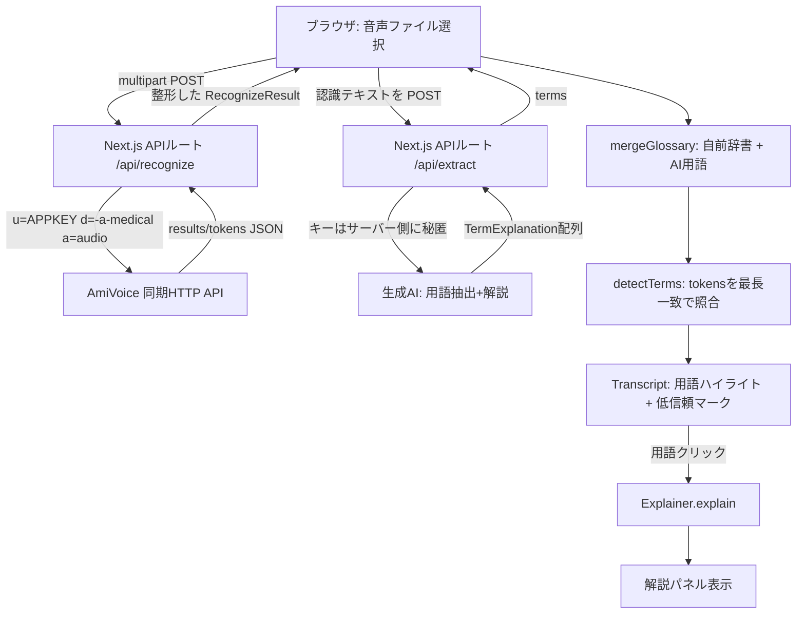

> 本記事は「音声認識AmiVoice APIと生成AIで作る音声体験」をテーマにした投稿です。医療会話の音声ファイルをアップロードすると、AmiVoice の医療エンジンで文字起こしし、出てきた病名・薬品名・検査名などの専門用語を自動でハイライト。クリックすると **生成AIが文脈に即した解説を返す**、研修医・医学生向けの音声学習ツールを、手元で再現できる粒度で作っていきます。

汎用の音声認識に医療会話を通すと、専門用語が崩れたり、どこが用語なのか判別できなかったりします。そこを AmiVoice の医療特化エンジンと、レスポンスに含まれる **単語単位（`tokens`）** のデータで解きます。さらに、辞書だけでは拾いきれない語を生成AIに抽出・解説させ、辞書とAIを**マージ**して使うハイブリッド構成にしました。


_音声をアップロードして文字起こし。専門用語が黄色くハイライトされ、クリックで右側に解説が出る_

---

## TL;DR

- **AmiVoice の `-a-medical`（会話\_医療）エンジン**で医療会話を文字起こしし、レスポンスの **`tokens[]`（単語単位）** を使って用語をハイライトする。`written`（表記）を照合キー、`confidence`（信頼度）を「聞き取りが不確実な箇所」のマークに使うのがこのアプリの肝。
- ハイライトする語は **自前の辞書（glossary）と生成AIの抽出結果をマージ**して決める。辞書は定番語の品質を担保し、AIは辞書未登録の語を文脈から拾う。
- 解説生成は **`Explainer` インタフェースで抽象化**し、辞書引きとLLMを差し替え可能にした。LLMプロバイダは **キーの有無で自動選択**（`GEMINI_API_KEY` があれば Gemini、なければ `ANTHROPIC_API_KEY` で Claude、どちらも無ければ辞書のみで動作）。
- スタックは **Next.js（App Router） / React / TypeScript**。AmiVoice の APPKEY と LLM のキーは **Next.js の API ルート（サーバー側）に隠して**ブラウザへ出さない。
- API は **同期HTTP**（1回のリクエストで送信〜結果取得が完結、16MB上限）を採用。長尺対応の非同期HTTPへ差し替えられる設計にしてある。

---

## なぜ AmiVoice の `tokens` が効くのか

一般的な音声認識APIの多くは「認識した一続きのテキスト」を返します。これだと文字起こしはできても、**どこが専門用語で、その箇所をどれくらい自信を持って認識したか**まではわかりません。

AmiVoice の同期HTTPレスポンスは、発話区間（`results[]`）の下に **単語単位の `tokens[]`** を持ちます。これが今回の設計を支えています。

| フィールド              | 意味                         | このアプリでの使いみち         |
| ----------------------- | ---------------------------- | ------------------------------ |
| `written`               | 単語の表記（例: `心筋梗塞`） | 辞書・AI抽出語との**照合キー** |
| `spoken`                | 読み（ひらがな）             | 解説パネルの読み表示           |
| `confidence`            | 単語の信頼度（0〜1）         | 低信頼の箇所に**注意マーク**   |
| `starttime` / `endtime` | 単語の時刻（ms）             | 将来：該当箇所の音声再生       |

加えてエンジンに **`-a-medical`（会話\_医療）** を選べる点が大きい。病名・薬品名・手術名・病院名といった医療語に強く、汎用エンジンより表記の崩れが少なくなります。「単語に区切られている」×「医療語に強い」が揃うことで、用語ハイライトという体験が成立します。

---

## アーキテクチャ



- **クライアント**: Next.js（App Router）/ React / TypeScript。
- **サーバー**: Next.js の Route Handler。AmiVoice の `AMIVOICE_APPKEY` と LLM のキーはここでだけ読む。
- **辞書/解説**: `data/glossary.json`（用語 → 読み・カテゴリ・要約・詳細）。AIキーが無いときのフォールバック。

ポイントは、**「どの語をハイライトするか（キーのリスト）」と「解説をどう作るか（Explainer）」を分離**したこと。生成AIは「認識テキスト全体から用語を抽出して解説も付ける」役だけを担い、既存のハイライト処理はそのまま再利用できます。

---

## AmiVoice 同期HTTPの使い方

まずは API 単体の挙動を `curl` で確かめます。リクエストは `multipart/form-data` で、`u`（APPKEY）・`d`（エンジン指定）・`a`（音声ファイル）の3つを送るだけです。

```bash
curl https://acp-api.amivoice.com/v1/recognize \
  -F u=$AMIVOICE_APPKEY \
  -F d=-a-medical \
  -F a=@demo/conversation.wav | jq
```

返ってくる JSON の構造は次の通りです。`results[].tokens[]` が主役です。

```json
{
  "utteranceid": "...",
  "text": "アドバンスト・メディアは豊かな未来を目指します",
  "code": "",
  "message": "",
  "results": [
    {
      "confidence": 0.998,
      "starttime": 250,
      "endtime": 8794,
      "text": "アドバンスト・メディアは豊かな未来を目指します",
      "tokens": [
        {
          "written": "アドバンスト・メディア",
          "spoken": "あどばんすとめでぃあ",
          "confidence": 1,
          "starttime": 522,
          "endtime": 1578
        }
      ],
      "tags": [],
      "rulename": ""
    }
  ]
}
```

知っておくと詰まらない仕様を表にまとめます。

| 項目             | 内容                                                                                 |
| ---------------- | ------------------------------------------------------------------------------------ |
| 成功判定         | `code == "" && message == "" && text != ""`                                          |
| 容量上限         | 16,777,215バイト（約16MiB）。16kHz/16bit/モノラルで約8〜9分                          |
| 発話の区切り     | 単一発話区間は最大15秒。超えると区切られ、1ファイルでも複数の `results` に分割される |
| 推奨フォーマット | wav / mp3 / flac / ogg / webm。16kHzエンジンは16kHz以上を推奨                        |

長尺を扱うなら、ジョブ登録→ポーリング型の**非同期HTTP**（エンドポイントとレスポンス構造が一部違う）に切り替えます。今回はファイルアップロード前提なので、実装が最も簡単な同期HTTPを選びました。

---

## 実装1: APPKEY を隠す API ルート

APPKEY をブラウザに出さないため、AmiVoice への通信は Next.js の API ルートに通します。クライアントは自分のサーバーの `/api/recognize` を叩くだけで、キーはサーバー側の環境変数からしか読みません。

```ts
// app/api/recognize/route.ts（要点）
const AMIVOICE_ENDPOINT = "https://acp-api.amivoice.com/v1/recognize";
const ENGINE = "-a-medical";
const MAX_BYTES = 16_777_215; // 同期HTTPの上限 約16MiB

export async function POST(request: Request): Promise<Response> {
  const appKey = process.env.AMIVOICE_APPKEY; // サーバー側のみ
  if (!appKey) {
    return Response.json(
      { error: "AMIVOICE_APPKEY が未設定です" },
      { status: 500 },
    );
  }

  const form = await request.formData();
  const file = form.get("audio");
  if (!(file instanceof File)) {
    return Response.json(
      { error: "音声ファイルがありません" },
      { status: 400 },
    );
  }
  if (file.size > MAX_BYTES) {
    return Response.json(
      { error: "ファイルが大きすぎます（16MBまで）" },
      { status: 413 },
    );
  }

  // u / d / a を AmiVoice へそのまま転送
  const upstream = new FormData();
  upstream.append("u", appKey);
  upstream.append("d", ENGINE);
  upstream.append("a", file, file.name || "audio");

  const res = await fetch(AMIVOICE_ENDPOINT, {
    method: "POST",
    body: upstream,
  });
  // ...成功判定のうえ results/tokens を整形して返す
}
```

`NEXT_PUBLIC_` を付けないことと、容量チェックをサーバー側でも持つことがポイントです。LLM のキーも同じ方針で `/api/extract` に隠します。

---

## 実装2: 用語検出（最長一致＋信頼度の伝播）

AmiVoice は用語を複数トークンに分割することがあります（例: `心筋` / `梗塞`）。そこで、トークンの `written` を**連結した1本の文字列**に対して、辞書の語を**長いものから順に**当てる最長一致で照合します。

もうひとつの工夫が、**ハイライトした区間の信頼度を、またがるトークンの最小値にする**こと。1文字でも自信のないトークンを含めば、その用語全体を「低信頼」として扱えます。

```ts
// lib/glossary/detect.ts（要点）
export function detectTerms(
  tokens: DetectToken[],
  glossaryKeys: string[],
): Segment[] {
  const text = tokens.map((t) => t.written).join("");

  // 各文字がどのトークン由来かのマップ
  const charToken: number[] = [];
  tokens.forEach((t, i) => {
    for (let k = 0; k < t.written.length; k++) charToken.push(i);
  });

  // 最長一致のため長い順に並べる
  const keys = glossaryKeys
    .filter((k) => k.length > 0)
    .sort((a, b) => b.length - a.length);

  // 区間[start, end)の信頼度 = またがるトークンのconfidenceの最小値
  const spanConfidence = (start: number, end: number) => {
    let min = 1;
    for (let c = start; c < end; c++) {
      min = Math.min(min, tokens[charToken[c]]?.confidence ?? 1);
    }
    return min;
  };

  // ...textを走査し term / plain のセグメントを confidence 付きで生成...
}
```

検出結果は `term`（用語）と `plain`（地の文）のセグメント列になり、用語だけをクリック可能なハイライトとして描画します。`confidence < 0.6` のセグメントには、**色だけに頼らずドット下線**で注意マークを付けています（色覚への配慮）。

---

## 実装3: 解説レイヤーを抽象化する

解説の作り方は実行環境で変わります。デモなら辞書を引くだけで十分ですが、本番では LLM に生成させたい。そこで `Explainer` というインタフェースで抽象化し、呼び出し側を変えずに中身を差し替えられるようにしました。

```ts
// lib/explainer/types.ts（要点）
export interface Explainer {
  explain(term: string): Promise<TermExplanation | null>;
}

// デモ/フォールバック: マージ済みの用語集を引く
export class CachedExplainer implements Explainer {
  /* ... */
}
```

クリック時に呼ぶのは `explainer.explain(term)` だけ。辞書実装でもLLM実装でも、UI 側のコードは一切変わりません。後述のハイブリッドは、この分離があるからこそ既存処理を壊さずに足せました。

---

## 実装4: 生成AIで「その場解説」をハイブリッドに作る

ここが本記事の主軸です。辞書だけだと**未登録の語はハイライトすらされない**という限界があります。その穴を生成AIで埋めます。

仕組みはシンプルで、認識が終わったら **テキスト全体を `/api/extract` に渡し、専門用語の抽出と解説をまとめて生成**させます。返ってきた用語を自前辞書にマージし、マージ後のキーで再度ハイライトを掛け直します。

```ts
// app/page.tsx（要点）。認識完了後にAI抽出を走らせる
const res = await fetch("/api/extract", {
  method: "POST",
  headers: { "Content-Type": "application/json" },
  body: JSON.stringify({ text: r.text }),
});
const body = await res.json();
setAiTerms(Array.isArray(body.terms) ? body.terms : []);

// 自前辞書（フォールバック）＋ AI抽出語（メイン）をマージ
const glossary = useMemo(() => mergeGlossary(baseGlossary, aiTerms), [aiTerms]);
```

サーバー側の `/api/extract` は **キーの有無でプロバイダを自動選択**します。`GEMINI_API_KEY` があれば無料枠のある Gemini、なければ `ANTHROPIC_API_KEY` で Claude、どちらも無ければ空配列を返して辞書のみで動作します。**同一テキストの再問い合わせはプロセス内キャッシュで弾く**ので、コストと遅延を抑えられます。

```ts
// app/api/extract/route.ts（要点）
const provider = geminiKey ? "gemini" : anthropicKey ? "anthropic" : null;
if (!provider) {
  return Response.json({ terms: [], disabled: true }); // 辞書フォールバックへ
}

// 同一テキスト×同一モデルはキャッシュヒット
const key = createHash("sha256")
  .update(`${provider}:${model}\n${text}`)
  .digest("hex");
const cached = cache.get(key);
if (cached) return Response.json({ terms: cached, provider, cached: true });

const raw =
  provider === "gemini"
    ? await callGemini(geminiKey, text)
    : await callAnthropic(anthropicKey, text);
const terms = parseExtraction(raw); // 壊れた出力でも空配列に丸める
cache.set(key, terms);
return Response.json({ terms, provider });
```

プロンプトとパースは `lib/explainer/llm/extraction.ts` に純粋ロジックとして切り出してあり、ネットワークなしでテストできます。システムプロンプトでは「抽出対象は医療用語のみ」「読み・カテゴリ・要約・詳細を付ける」「**解説は学習補助で診療判断には使わない**」を明示し、`parseExtraction` はコードフェンス付きの応答や壊れた JSON を空配列に丸めてアプリを落とさないようにしています。

### before / after で効果を見る

辞書から4語（狭心症・心電図・不整脈・冠動脈）をあえて削除した状態で、AI の有無を比べます。

まず **AI 無し（辞書のみ）**。削除した語はハイライトされず、地の文に埋もれています。


_辞書に無い語は拾えない。これが辞書単独の限界_

次に **ハイブリッド（AI 有り）**。AI が削除した4語を文脈から拾い、上部に「AIが13件の用語を抽出しました」と出て、すべての用語がハイライトされます。


_AIが文脈から用語を補完。辞書の穴が埋まる_

辞書未登録の語をクリックすると、AI が生成した解説が表示されます。出所がわかるよう、解説末尾に **【glossary未登録・AI抽出】** と明記しています。


_辞書に無い「狭心症」もAIが解説。出所を明示してハルシネーションに注意を促す_

各方式のトレードオフを整理すると次の通りです。

| 観点         | 自前辞書         | AI抽出               | ハイブリッド       |
| ------------ | ---------------- | -------------------- | ------------------ |
| 未知語       | ×                | ◎                    | ◎                  |
| 実行時コスト | 無料             | 課金                 | キャッシュで抑制   |
| 速度         | 即時             | 遅延あり             | 初回のみ遅延       |
| 正確性       | 高（人手で担保） | ハルシネーション注意 | 定番語は辞書で担保 |
| 保守         | 辞書更新が必要   | 不要                 | 中                 |

ハイブリッドは「定番語の品質は辞書で担保しつつ、未知語はAIで拾う」という、両者のいいとこ取りになっています。

---

## confidence の可視化と医療の安全配慮

AmiVoice の `confidence` は「その単語をどれくらい自信を持って認識したか」を示します。医療会話では、聞き取りが曖昧な箇所こそ確認したい。そこで低信頼のセグメントには色とドット下線の両方で印を付け、初期状態の凡例にも「低信頼: 認識が不確実な箇所」と明示しています。


_アップロード前の初期状態。凡例で「低信頼」マークの意味を先に示す_

安全面では、解説に必ず「**学習補助であり診療判断には用いない**」前提を持たせています。システムプロンプトにも同じ制約を入れ、AI 生成にはハルシネーションの可能性があるため重要事項は一次情報で確認する、という姿勢を UI と出力の両方で崩さないようにしました。

---

## ハマりどころ

手を動かす中で詰まった箇所を残しておきます。

| 症状                                           | 原因                                                         | 対処                                                                                               |
| ---------------------------------------------- | ------------------------------------------------------------ | -------------------------------------------------------------------------------------------------- |
| `request.formData()` が jsdom 環境でハングする | File ボディのパースが jsdom の Request で止まる              | API ルートのテストはファイル先頭に `// @vitest-environment node` を付けて Node 環境で実行          |
| 用語がハイライト漏れする                       | AmiVoice の `written` が辞書キーと完全一致しない（表記ゆれ） | 最長一致に加え、ゆれキーを辞書へ追加。固有名詞は AmiVoice の**ユーザー辞書**で認識精度を上げる手も |
| 信頼度マークが出すぎ／出なさすぎ               | `confidence` 未指定トークンを 1.0 扱いにしている割り切り     | しきい値（`< 0.6`）で調整。色だけでなくドット下線も併用                                            |
| LLM の応答が JSON として壊れる                 | モデルがコードフェンスや説明文を付ける                       | `parseExtraction` でフェンス除去・パース失敗時は空配列に丸める                                     |

表記ゆれは医療語ほど起きやすいので、辞書の最長一致と AmiVoice 側のユーザー辞書を組み合わせるのが現実的でした。

---

## まとめ

- AmiVoice の `-a-medical` エンジンと **単語単位の `tokens`** を使うと、「どこが用語か」「どれくらい自信があるか」まで踏み込んだ音声体験が作れる。
- ハイライト対象（キー）と解説（Explainer）を**分離**しておくと、生成AIは「抽出＋解説」だけを担えばよく、既存処理を壊さずハイブリッド化できる。
- 辞書とAIの**マージ**で、定番語は辞書で品質担保しつつ未知語はAIで補完できる。キャッシュとフォールバックでコスト・可用性も両立。
- APPKEY と LLM キーは **Next.js の API ルートに隠す**。容量チェックや成功判定もサーバー側に持たせる。
- 医療領域なので、解説は学習補助に限定し、`confidence` の低信頼マークと「診療判断には使わない」明示で安全側に倒す。
- 今後は `starttime`/`endtime` を使った該当箇所の再生、非同期HTTPでの長尺対応、WebSocket でのリアルタイム化が広げどころ。

---

## 関連記事

生成AI（画像生成）を Next.js + Supabase で組み込んだ実装事例として、こちらも合わせてどうぞ。

https://zenn.dev/ryukoeng/articles/youcam-image-to-image-body-log
